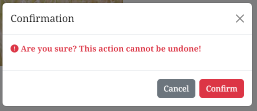
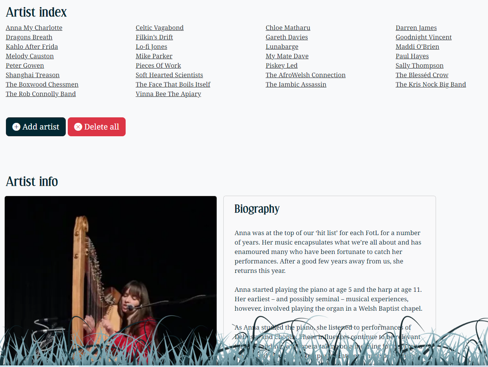

# Folk on the Lawn Website


This project creates a website for a music festival called Folk on the Lawn. It allows external users to find information about the festival, and allows site admins to update line-up and artist information. The site is designed to be responsive and accessible on a range of devices, making it easy to navigate for external users and site admins alike.

[View the live project here](https://folk-on-the-lawn-5be73867df7e.herokuapp.com/)


## Table of Contents

1. [Project Goals](#project-goals)
2. [Research](#research)
3. [User Stories](#user-stories)
4. [Design](#design)
5. [Features](#features)
6. [Testing](#testing)
7. [Tecnologies Used](#technologies-used)
8. [Deployment](#deployment)
9. [Credits](#credits)


## Project Goals

### Purpose

A promotional website for a musical festival, which allows festival organisers to provide and update information about the festival with ease, while providing access to that information for prospective festival goers.

### Client Goals

The client is a team of volunteers who organise the Folk on the Lawn festival every year. Their goals are to:

- Have an engaging site which promotes the festival and attracts attendees
- Minimise avoidable contact by clearly providing the information sought by prospective attendees 
- Allow admin users to update information on the website quickly and easily, regardless of technical ability

### User Goals

The primary goals of the user are to:

- Find out key information about the festival such as location, dates and how to buy tickets
- Find out information about who is playing at the festival and when
- Find out where to go for more information or to contact the festival organisers

Detailed user stories are provided in the [User Stories](#user-stories) section below.

## Research

### User research

Before embarking on any design or development work, I used the festival's existing website and social media channels to gather user views. This research covered users' preferred online platforms, what particular information they were looking for when visiting the website, their experience of using the existing site to find that information, and any suggessted improvements.

42% of users preferred using the website (rather than social media) to access information about Folk on the Lawn, suggesting the website remains an important way for the festival to engage with its audience.

<details><summary>Preferred online platform</summary>


</details><br>

The top 3 things users are seeking when visiting the website are:
- Line-up and schedule
- Dates and times
- Ticketing information

In terms of people's success finding that information on current platforms, the top rating of 5 scored highest, but the majority provided a rating of 4 or less, suggesting room for improvement.

<details><summary>Success ratings</summary>


</details><br>

When it came to suggested improvements:
- 50% of respondents mentioned providing more up-to-date information
- 33% mentioned improvements to navigation and presentation, especially on mobile devices

All of these factors were taken into account in developing the [User Stories](#user-stories) below.

### Existing music festival websites

To aid consideration of presentation and content, I also researched existing music festival websites, particularly those appealing to a similar clientele. These included smaller festivals, comparable in size to Folk on the Lawn itself, as well as larger, commercial festivals.

#### Smaller festivals
- [Off The Beaten Track](http://www.otbtfest.org/tickets.html)
- [Bromyard Folk Festival](https://bromyardfolkfestival.co.uk/)
- [Barn on the Farm](https://www.barnonthefarm.co.uk/)

#### Larger festivals
- [Green Man](https://www.greenman.net/)
- [End of the Road](https://endoftheroadfestival.com/)
- [Cambridge Folk Festival](https://www.cambridgelive.org.uk/folk-festival)

Inevitably the presentation and content of these sites varies, but it is noted that line-up, dates and ticketing information are prominent and accessible on each and every site - in line with the top three topics of interest identified through my user research. In addition, most of the sites provide highly visible social media and contact links. Many of the sites include a gallery, while further information such as location and camping details are less visible, often behind a broad "info" link.

Adding "/admin" to the roots of these sites confirmed that many of them also have an admin function behind the public-facing page, e.g. [Green Man Admin](https://www.greenman.net/admin/). While I was obviously unable to view the actual admin pages, this reinforced my view that an admin function behind a login page was typical for websites of this type. 

## User Stories

Based on the research and project goals outlined above, I have identified the following user stories. These are split into a number of categories, namely **visitors** (external users of the site, e.g. potential festival attendees), **admins** (festival team members who are trusted to update the website) and **superusers** (a small number of individuals who can perform more fundamental actions relating to the website, in addition to all admin functions).  

A. As a **first-time visitor** I want to:
1. Determine key details of the festival such as location, dates and ticket information
2. Discover more about the festival and whether it is likely to interest me
  
B. As a **returning visitor** I want to:  
1. Find out who is playing the festival on which days
2. Buy tickets if I decide to attend
3. Find further sources of information such as social media pages

C. As an **admin user** I want to:
1. Provide key information about the festival such as dates and ticket information
2. Add line-up information and details of the artists playing
3. Provide up-to-date messages to attendees (or potential attendees) in the lead-up to the festival

D. As a **superuser**, in addition to the admin functions outlined above, I want to: 
1. Add or remove admins and amend their privileges
2. Back up important data, and restore it if necessary

## Design

### Wireframes

Wireframes were created using the Figma platform: [Figma - Folk on the Lawn](https://www.figma.com/file/IjXmZ89Phzn0gKjmCOi23H/Folk-On-The-Lawn?type=design&node-id=0%3A1&mode=design&t=OZXv6ccJLV76wfPm-1).

<details><summary>Desktop wireframes - public</summary>


</details>

<details><summary>Desktop wireframes - admin/superuser</summary>


</details>

<details><summary>Mobile wireframes - public</summary>


</details><br>

Based on prior experience I decided that desktop and mobile wireframes would be sufficient to keep the overall layout of the site on track, the expectation being that [Bootstrap's grid system](https://getbootstrap.com/docs/5.3/layout/grid/) would provide the responsiveness required at different device breakpoints in between (see [Layout and Styling](#layout-and-styling) section below).

Furthermore, the mobile wireframes do not include the admin/superuser pages, as I envisaged that these would generally be accessed using a desktop device, and seldom from a mobile device. While the site is of course accessible from any device and its content will adjust accordingly, I considered there to be little value in producing specific wireframes for this purpose.

#### Differences between wireframes and final design

While the overall structure of the site stays true to the wireframes, there are some notable differences in the final design which came about for design and user experience reasons:

- The schedule table on the **Line-up** page utilises the [Boostrap Accordion](https://getbootstrap.com/docs/5.3/components/accordion/) component. While this was envisaged from an early stage, it was not included in the wireframes.
- During development I discovered [Boostrap Cards](https://getbootstrap.com/docs/5.3/components/card/), along with [Masonry layout](https://masonry.desandro.com/), providing an engaging design on the **Line-up** page quite different to that provided in the wireframes.
- The **Register** page was renamed **Superuser dashboard** due to the additional backup and restore functionality.

In addition, while not affecting the overall design, a number of the pages include features or fields not included in the wireframes. See the [Features](#features) section for more details.

### Layout and Styling

#### Bootstrap

The site uses the [Bootstrap 5.3 Grid system](https://getbootstrap.com/docs/5.3/layout/grid/) to ensure it is fully responsive on all device and viewport sizes. Bootstrap 5.3 uses the following [breakpoints](https://getbootstrap.com/docs/5.3/layout/breakpoints/), the shorthand references for which are used throughout the rest of this document:

| Breakpoint        | Shorthand   | Dimensions |
|-------------------|-------------|------------|
| Extra small       | xs          | <576px     |
| Small             | sm          | ≥576px     |
| Medium            | md          | ≥768px     |
| Large             | lg          | ≥992px     |
| Extra large       | xl          | ≥1200px    |
| Extra extra large | xxl         | ≥1400px    |

In addition, the site uses the following specific components from the Bootstrap library:

- [Navbar](https://getbootstrap.com/docs/5.3/components/navbar/) for the header and subheader.
- [Form components](https://getbootstrap.com/docs/5.3/forms/overview/) throughout the admin and superuser pages.
- [Spacing](https://getbootstrap.com/docs/5.3/utilities/spacing/) and [typography](https://getbootstrap.com/docs/5.3/content/typography/) utility classes throughout, ensuring the layout and font are appropriate to the device in use.
- [Color](https://getbootstrap.com/docs/5.3/utilities/colors/) utility classes to provide specific meaning to text throughout.
- [Display property](https://getbootstrap.com/docs/5.3/utilities/display/) to toggle the visibility of some components at certain breakpoints.
- [Modal plugin](https://getbootstrap.com/docs/5.3/components/modal/) to display alerts before items are deleted.
- [Accordion](https://getbootstrap.com/docs/5.3/components/accordion/) to provide a collapsible menu for the schedule on the Line-up page.
- [Cards](https://getbootstrap.com/docs/5.3/components/card/) to display artist information on the Line-up page (public) and the Artists page (admin).

#### Masonry layout

The Line-up page uses [Masonry](https://masonry.desandro.com/) grid layout, placing the artist cards in optimal position based on available vertical space. 

### Imagery

- **Main image**: The main image displayed on the **Home** page is editable by admin users, providing a customisation option. For demonstration purposes the image provided is a man carrying an acoustic guitar standing in a grass field, courtesy of [Ben White on Unsplash](https://unsplash.com/photos/man-carrying-brown-cutaway-acoustic-guitar-standing-on-green-grass-field-iPyQg9QfepM).

- **Footer image** The footer includes a stylised image of a lawn in various shades of green aligned with the overall [colour scheme](#colour-scheme), on a transparent background.

- **Artist images**: Artist images are uploaded by admin users, and displayed on the **Line-up** page (public) and **Artists** page (admin).

- **403 image**: The **403 (Forbidden)** error page includes an image of a person holding their hand to the camera to indicate that access is denied, courtesy of [Nadine Shaabana on Unsplash](https://unsplash.com/photos/close-up-photography-of-person-lifting-hands-DRzYMtae-vA).

- **404 image**: The **404 (Page Not Found)** error page includes an image of a microphone on an empty stage, courtesy of [Oscar Keys on Unsplash](https://unsplash.com/photos/photo-of-microphone-on-foggy-stage-ojVMh1QTVGY).

- **500 image**: The **500 (Internal Server Error)** error page includes an image of an acoustic guitar on fire, courtesy of [Dark Rider on Unsplash](https://unsplash.com/photos/flaming-guitar-digital-wallpaper-JmVaNyemtN8).

- **Logo**: The logo is simply a stylised representation of the festival name using the [Effloresce font](https://www.dafont.com/effloresce.font). The logo appears in its full form on sm devices and above, and adjusts to a compressed format of "FotL" on xs devices.

  <details><summary>Full Logo</summary>
  
  
  
  </details>

  <details><summary>Compressed Logo</summary>
  
  
   
  </details><br>

### Colour Scheme
  
- The **primary colour** of the website is a dark shade of green (#022832), reflecting the "lawn" of the festival name. This is used for the **header**, **headings** and **primary buttons** throughout the site, as well as the background of artist cards on the **Line-up** page.

- The **logo** uses Bootstrap's .text-light utility class (#F8F9FA). The **dates** and **location** also use this class, but with an opacity of 75% so that they show more of the green background, making them less pronounced.

- The **navbar** uses Bootstrap's .navbar-dark class, providing the navigation items with white text with approximately 50% opacity (#FFFFFF8C).

- The **admin menu** uses the same shade of green as the main header, but with 20% opacity (#02283233) so that it appears lighter, while complementing the darker shade of the main header. It uses Bootstrap's .navbar-light class which provides darker navigation items (#000000A6).

- The **footer** uses the primary green used elsewhere (#022832), along with complementary lighter shades (#7CA3AE, #426973), providing a similar colour contrast as the header.

- The **background** is an off-white (#F9F9FA), providing a contrast to the dark header and body text.

- Primary **buttons** use the main green colour (#022832) mentioned above, while buttons used on forms throughout the site use Bootstrap's .bg-danger (#DC3545) and .bg-warning (#FFC107) utility classes depending on their function.

- Body **text** is black (#000000), while Boostrap's utility classes are used to convey meaning to text throughout, in particular .text-danger (#DC3545) for urgent warnings, and .text-info (#0DCAF0) for flash messages.

  <details><summary>Colour scheme palette</summary>

  

  </details>

### Typography

- The **logo**, **headings** and **navigation items** use Effloresce, downloaded from [Dafont](https://www.dafont.com/effloresce.font) as a TrueType font and converted to @font-face using [Transfonter](https://transfonter.org/). The fallback font is Serif. Effloresce is a stylish serif font with a slight rustic feel, in keeping with the ethos of the festival.

    <details><summary>Effloresce</summary>

    

    </details><br>

- The **strapline** on the Home page uses Dancing Script, imported from [Google Fonts](https://fonts.google.com/specimen/Dancing+Script), with Sans Serif as the fallback font. Dancing Script is a playful but sophisticated script font which suits the content of the strapline "Innovative Folk for Innovative Folk".

    <details><summary>Dancing Script</summary>

    

    </details><br>

- The **body** and all other elements use Noto Serif, imported from [Google Fonts](https://fonts.google.com/noto/specimen/Noto+Serif), with Serif as the fallback font. Noto Serif is a straightforward serif font which complements the Effloresce font used for the logo and headings.

    <details><summary>Noto Serif</summary>

    

    </details><br>

### Icons

  [Bootstrap Icons](https://icons.getbootstrap.com/) have been used for **navigation items**, **social media links**, **buttons** and **form elements**, utilised as classes in the `<i>` tag.

  <details><summary>Navigation icons</summary>

  

  </details>

  <details><summary>Button icons</summary>

  

  </details>
  
### Favicon

   The favicon is a grass icon using the site's colour scheme, generated using [Favicon Generator](https://www.favicon-generator.org/).

  <details><summary>Favicon</summary>

  

  </details>

## Features

### Scope

- #### Minimum Viable Product

  To be viable as a music festival website and meet the stated [Project Goals](#project-goals), the website **must have**:
  1. A public front-end website including key information about the festival such as location, dates, how to buy tickets and line-up.
  2. An admin portal which allows admin users to update line-up and artist information on the website quickly and easily, regardless of technical ability.
         
- #### Additional Features (in scope)

  To provide a good user experience in line with the stated [Project Goals](#project-goals), the website **should have**:
  1. Contact information and social media links.
  2. A schedule visible to public users which is automatically generated based on showtimes provided by admin users. 
  3. The ability for admins to add and edit key information about the festival such as dates and stage names, allowing the website to be updated year on year without adjusting any code.
  4. The ability for admins to provide up-to-date messages to attendees (or potential attendees) in the lead-up to the festival.
  5. A superuser dashboard, allowing admins to be added and deleted, and data to be backed up and restored.
   
- #### Future Ideas (not currently in scope)
  
   To provide a better user experience and better meet the stated [Project Goals](#project-goals), the website also **could have**:
   1. A schedule builder, allowing public users to build their own schedule of artists they wish to see from the overall schedule.
   2. An application portal, allowing artists to apply to perform at the festival.
   3. An artist booking system, allowing information about artists to be submitted to a page only visible by admins, allowing admins to comment on and/or vote on artists, and allowing bookings to be confirmed or denied once a decision has been made, the artist information then becoming public.
   4. A gallery page, either using a portal to allow admins to upload photos directly, or embedding the festival's Instagram feed.

### Python Functionality using Flask

Python has been used to build the core backend application which underpins the site, utilising the [Flask web framework](https://flask.palletsprojects.com/en/3.0.x/). In particular, Python and Flask have been used to:

- Provide routing of pages, allowing meaningful URLs to be used to return pages and content to the user.
- Connect to the backend database to retrieve information and serve it to the site, and to allow creation, updating and deletion of records.
- Provide login functionality and security, ensuring only authorised users can access and edit particular information.
- Display flash messages to the user.

### Database

The backend application connects to a database hosted on [MongoDB](https://www.mongodb.com/), which contains three collections as outlined below.

#### Admins

Contains entries for all admins registered on the site.

- Example admin entry:
  ```
  {
    _id: (unique value)
    name: "Nick Smith"
    username: "nicksmith"
    password: (hashed password)
    is_superuser: "on"
    date_added: "03/11/2023"
  }
  ```

#### Key Info

Contains a single entry providing key details of the festival and other information for displaying on the site.

- Example key_info entry:
  ```
  {
    _id: (unique value)
    event_start: 2023-07-13T00:00:00.000+00:00
    event_end: 2023-07-16T00:00:00.000+00:00
    stages: Array (4)
      0: "River"
      1: "Mill"
      2: "Cottage"
      3: "Bar"
    display_schedule: "on"
    main_img: "w93ykgjdg5dwi4es2zni"
    banner_heading: "Schedule now live!"
    banner_text: "Please take a look on the line-up page."
    fundraising_url: "https://www.justgiving.com/crowdfunding/fotl2023new"
    last_edit_by: "nicksmith"
    last_edit_on: "21-11-2023"
  }
  ```

#### Artists

Contains entries for all artists

- Example artists entry:
  ```
  {
    _id: (unique value)  
    artist_name: "Anna My Charlotte"
    artist_bio: "Anna was at the top of our ‘hit list’ for each FotL for a number of ye…"
    artist_url: "https://annamycharlotte.bandcamp.com/"
    artist_img: "bgc00xfj70g79c8s24xc"
    show1_stage: "Cottage"
    show1_start: 2023-07-15T18:00:00.000+00:00
    show1_duration: "45"
    show2_stage: "River"
    show2_start: 2023-07-16T11:00:00.000+00:00
    show2_duration: "45"
    show3_stage: ""
    show3_start: 1900-01-01T00:00:00.000+00:00
    show3_duration: ""
    last_edit_by: "nicksmith"
    last_edit_on: "21-11-2023"
  }
  ```

### Page Elements and Interaction

The website is divided between public-facing pages which provide information to external users sourced from the database, and admin pages (for logged in users) which allow admins to update information in the database. There is also a superuser dashboard which is only visible to logged in users with superuser credentials. 

#### Public pages and elements

- **Header**: All pages include a header with branding on the left-hand side, a navigation menu on the right-hand side, and festival dates and location with flexible positioning (see below). The festival dates are retrieved from the database by the backend application and served to the template, which parses the information and displays it accordingly. The header is fully responsive:
  - The branding (festival name) is displayed in its full form on sm viewports and above, but compresses to a shortened form on xs viewports.
  - The festival dates and location are displayed beneath the branding on sm viewports and above, but horizontally centred on xs viewports.
  - The navigation menu is displayed as a single line on lg viewports and above, but collapses to a hamburger menu on md viewports and below.
         
    <details><summary>Header (lg)</summary>
          
    

    </details>
        
    <details><summary>Header (sm)</summary>
          
    

    </details>
        
    <details><summary>Header (xs)</summary>
          
    

    </details><br>

- **Home page**: Provides general information about the festival, and includes:
  - A **Hero Image** which is editable by admin users, overlaid with a strapline of "Innovative Folk for Innovative Folk" against a light, semi-transparent background.
  - An optional **Banner Message** which is editable by admin users.
  - A call to action to **Support the Festival** with a donation button which opens a fundraising page in a separate tab.
  - An **About** section with general background information.
  - A **Location** section with an embedded map from [Google Maps](https://developers.google.com/maps/documentation/embed/get-started) and directions.

    <details><summary>Home (lg)</summary>

    - Hero image and banner<br>  
      
    
    - Support, About and Location<br>    
      

    </details>

    <details><summary>Home (xs)</summary>
    
    - Hero image, Banner and Support<br>
      
    
    - About<br>
      

    - Location<br>
      

    </details><br>

- **Line-up page**: Provides schedule information and details of artists playing, including:
  - A day-by-day **Schedule** with collapsible menu utilising the [Boostrap Accordion](https://getbootstrap.com/docs/5.3/components/accordion/) component. Showtime information is compiled in the backend application using information from the database and served to the template, which parses the information and displays it accordingly. 
  - An **Artist Index** with hyperlinks to provide easy access to artist information. The list of artists is retrieved from the database by the backend application and served to the template to form the links, which point to separate ```<div>``` elements for each artist.
  - Individual **Artist Cards** utilising [Boostrap Cards](https://getbootstrap.com/docs/5.3/components/card/), and [Masonry layout](https://masonry.desandro.com/), providing a photo of the artist, a list of their appearances, and an external link to their website. Each card also includes a transition which flips the card to display the artist's biography. The information provided in each card is retrieved from the database by the backend application and served to the template, which parses the information and displays it accordingly. 

  All elements are responsive, for example the stage listings within the Schedule appear side-by-side on lg viewports but vertically stacked on xs viewports, with the Artist Cards behaving similarly.

    <details><summary>Line-up page (lg)</summary>

    - Schedule<br>
      
    
    - Artist Index<br>
      

    - Artist Cards<br>
      

    </details>

    <details><summary>Line-up page (xs)</summary>

    - Schedule<br>
      
    
    - Artist Index<br>
      
    
    - Artist Cards<br>
      

    </details><br>

- **Confirmation modal**: For any change which will result in irreversible changes to data, e.g. deletion, a warning is displayed asking the user if they are sure. In such cases the delete button is coded to trigger the modal, and data attributes are used to provide the wording of the warning and the target for the confirm button. Pressing the confirm button then directs the user to the relevant target, triggering the intended action.

  <details><summary>Confirmation modal</summary>

  

  </details><br>

- **Flash messages**: Flash messages are displayed to provide information to the user, e.g. when logging in and logging out, or when changes are made to database entries.

  <details><summary>Flash messages</summary>

  <br>
  
    
  </details><br>

- **403 (Forbidden)**: A 403 (Forbidden) error is displayed in the event that a user tries to browse to a page that they are not authorised for. The 403 page includes an image of a person holding their hand to the camera to indicate that access is denied, together with the message "Sorry, this area is for crew only! Please select an item from the navigation menu above." 

- **404 (Page Not Found)**: A 404 (Page Not Found) error is displayed in the event that a user tries to browse to a page that does not exist. The 404 page includes an image of a microphone on an empty stage, together with the message "Sorry, this stage is empty! Please select an item from the navigation menu above." 

- **500 (Internal Server Error)**: A 500 (Internal Server Error) error is displayed in the event of an error in the application or the server. The 500 page includes an image of an acoustic guitar on fire, along with the message "Well, this wasn't meant to happen! Please select an item from the navigation menu above to start again." 

#### Admin pages and elements

While all admin pages are fully responsive, screenshots below are shown in desktop format only, as they would be expected to be accessed primarily by desktop.

-  **Subheader**: All admin pages include an additional subheader, beneath the main header, with a label ("Admin menu") on the left-hand side and a navigation menu on the right-hand side.

    <details><summary>Subheader</summary>
          
    

    </details><br>
        
- **Login**: Includes a simple login form with username and password, and an email link if the user has forgotten their password. The backend application puts the user in session if the username and password are correct, or alerts the user with a flash message otherwise. If an event start date has been provided (see below) and it is in the past, the user is directed to the Key Info page (since an event in the past indicates that the key information requires updating). Otherwise the user is directed to the Artists page.

    <details><summary>Login form</summary>
          
    

    </details><br>

- **Key Info**: Provides a form allowing key information about the festival to be submitted by admins and saved in the database, in particular:
  - Start date
  - End date

    - The **start date** and **end date** utilise the [flatpickr](#flatpickr) date picker plugin.

  - Stage names (as comma separated values)
  - Whether the Schedule should be displayed on the Line-up page (toggle switch)
  - Main image for the Home page (with a preview of the current image)

    - The **main image** is uploaded to the [Cloudinary](https://cloudinary.com/) image hosting platform, which returns a unique ID for the image. The ID is stored in the database and used along with a base URL provided in the backend application to render the image wherever it is required.

  - Banner heading and text for the Home page
  - Fundraising link accessible through the button on the Home page

  The page includes a **Save changes** button. It also includes a **Delete event** button, although this actually submits blank values to the database (01-01-1900 in the case of dates), rather than actually deleting the entry in the database.

  <details><summary>Key Info</summary>
          
  
  

  </details><br>
      
- **Artists**:

  - Displays an index of artists already added, along with buttons to add an artist or delete all. Details of existing artists are displayed using [Bootstrap Cards](https://getbootstrap.com/docs/5.3/components/card/), along with buttons to delete the artist or edit their details. The information provided in each card is retrieved from the database by the backend application and served to the template, which parses the information and displays it accordingly.
  
    <details><summary>Artists</summary>
            
    
    

    </details><br>
  
  - If no artists have yet been added but dates and stages have been added to the Key Info collection, the user is informed that no artists have yet been added, and is presented with the Add Artist button.
  
    <details><summary>No artists warning</summary>
          
    

    </details><br>

  - If there are no artists, and dates or stages are missing from the Key Info database, the user is informed that they must provide this information before artists can be added.

    <details><summary>No dates warning</summary>
          
    

    </details><br>

- **Add Artist**: Provides a form allowing artist information to be submitted by admins, in particular:
  - Name
  - Biography
  - Website
  - Image

    - The image is uploaded to the [Cloudinary](https://cloudinary.com/) image hosting platform, which returns a unique ID for the image. The ID is stored in the database and used along with a base URL in the backend application to render the image wherever it is required.

  - Show information for up to three shows - including stage, date and time, and duration

    - The entry for date and time for each show utilises the [flatpickr](#flatpickr) date picker plugin, with dates limited to those provided by the Key Info database.

      <details><summary>Show date picker</summary>
                
      
        
      </details><br>

    - The stage selection for each show is generated from the information provided on the Key Info page and saved in the database.

      <details><summary>Show stage select</summary>
                
      
        
      </details><br>

  The page includes an **Add** button to add the artist to the database using the submitted details.

  <details><summary>Add artist</summary>
            
    
    

  </details><br>

- **Edit artist**: As above for "Add artist", but existing information is presented to the user, including a preview of any image already submitted. The page includes a **Save changes** button which updates the database with the edited values.

  <details><summary>Edit artist</summary>
          
  
  

  </details><br>

#### Superuser dashboard

The site includes a Superuser Dasboard, accessed through a link in the admin menu which is only visible to logged in users with superuser credentials.

  <details><summary>Superuser link</summary>
          
  
  
  </details><br>

The dashboard allows an admin with superuser access to:
- Register new admins.
- Toggle the superuser status of an existing admin.
- View all registered admins.
- Backup and restore the festival key information and artists.

  <details><summary>Superuser dashboard</summary>

  - Registration<br>     
    
  
  - Existing admins<br>
    

  - Backup and restore<br>
    
  
  </details><br>


### JavaScript Functionality

#### jQuery

- The jQuery libary has been used to faciliate the use of JavaScript, in particular for adding event listeners.

#### flatpickr

- The [flatpickr plugin](https://flatpickr.js.org/) has been used to provide date pickers for festival dates and showtimes.

  <details><summary>Date picker</summary>

  
  
  </details><br>

#### Flip cards

- The flip card function on the **Line-up** page uses CSS, but JavaScript has been used to add an event listener for toggling the "flipped" class. This functionality is ignored for anchor tags to allow the artist website to be linked from the card without flipping it.

#### Masonry and imagesLoaded

- The artist cards on the **Line-up** page use the [Masonry](https://masonry.desandro.com/) JavaScript library to provide the particular grid layout. The [imagesLoaded](https://imagesloaded.desandro.com/) libary is also used to [prevent unloaded images throwing off the layout](https://masonry.desandro.com/layout#imagesloaded).

#### Varying modal content

- A JavaScript snippet from the [Boostrap documentation](https://getbootstrap.com/docs/5.3/components/modal/#varying-modal-content) has been adapted, allowing the content and function of confirmation modals to be varied using the data attributes of the buttons which trigger them. 


## Testing

### Automated testing

- #### HTML validation with [W3C Markup Validator](https://validator.w3.org/)

  | **Error/Warning**         | **Location**           | **Fix**                                                                              |
  |---------------------------|------------------------------|--------------------------------------------------------------------------------------|
  | Warning: ```<section>``` lacks heading | Base template: Flash messages ```<section>``` | - N/A: ```<section>``` remains the most relevant tag and this is only a warning |
  | Error: Element ```<h3>``` not allowed as child of element button in this context | Line-up page: Accordion headers | - Changed ```<h3>``` to ```<span>``` with Bootstrap class ```"fs-3"``` |
  | Warning: Empty heading | Line-up page: Accordion headers | - N/A: The heading is provided in the Boostrap code, and this is only a warning |
  | Error: No ```<p>``` element in scope but a ```</p>``` end tag seen | Line-up page: Show listings in footer of each card | - Changed ```<p>``` to ```<div>``` |
  | Info: Trailing slash on void elements has no effect and interacts badly with unquoted attribute values | Key Info page: ```<input>```element for main image | - Remove trailing slash |
  | Error: Bad value (Artist Name) for attribute ```id``` on element ```<div>```: An ID must not contain whitespace | Artists page: Biography ```<div>``` for each artist | - Remove whitespace from parsed artist name in ```<div>``` |
  | Error: Duplicate ID (Artist Name) | Artists page: Biography ```<div>``` for each artist  | - Added ```"-bio``` suffix to biography ```<div>``` |
  | Info: Trailing slash on void elements has no effect and interacts badly with unquoted attribute values | Add Artist page: ```<input>```element for artist image | - Remove trailing slash |
  | Info: Trailing slash on void elements has no effect and interacts badly with unquoted attribute values | Edit Artist page: ```<input>```element for artist image | - Remove trailing slash |
  | Error: Attribute ```value``` not allowed on element ```<select>``` at this point | Show 2 stage ```<select>``` element | - Delete ```value``` |

- #### CSS validation with [W3C CSS Validator](https://jigsaw.w3.org/css-validator/)

  No errors found

- #### JavaScript validation using [JSHint](https://jshint.com/)

  | **Error/Warning**         | **Location**           | **Fix**                                                                              |
  |---------------------------|------------------------------|--------------------------------------------------------------------------------------|
  | Two undefined variables: ```event_start```, ```event_end``` | script.js lines 32, 33 | - N/A: These variables are declared within ```<script>``` tags in the base template, which is necessary in order to parse the values retrieved from the database using [Jinja](#languages) |

- #### Python validation using [CI Python Linter](https://pep8ci.herokuapp.com/)

  | **Error/Warning**         | **Location**           | **Fix**                                                                              |
  |---------------------------|------------------------------|--------------------------------------------------------------------------------------|
  | E501 line too long | Throughout app.py | - Lines shortened |
  | E302 expected 2 blank lines, found 1 | app.py, line 46 | - Added blank line |
  | W291 trailing whitespace | app.py, line 87 | - Deleted whitespace |
  | W293 blank line contains whitespace | app.py, line 722 | - Deleted whitespace |
  
- #### Accessibility using [Lighthouse accessibility](https://developer.chrome.com/docs/lighthouse/accessibility/)

  Lighthouse audit scores (accessed through Chrome DevTools) show that the site is fully accessible and complies with best practices.

  <details><summary>Lighthouse scores</summary>

  

  </details>

### Manual Testing

#### User stories

The site was tested against the user stories as follows. (See [User story screenshots](#user-story-screenshots) below table for associated screenshots.)
| **User goal**                                                                    | **How it is achieved** |
|----------------------------------------------------------------------------------|------------------------|
| _A. As a first-time visitor I want to:_ |                        |
| 1. Determine key details of the festival such as location, dates and ticket information | Location and dates of the festival are displayed prominently in the page header on every page. Ticket nformation is displayed on the Home page as a call to action under the heading "Support the Festival", so it is one of the first things a visitor sees. |
| 2. Discover more about the festival and whether it is likely to interest me | The "About" section on the Home page provides comprehensive background information about the festival and the types f artists which will be playing. |
| _B. As a returning visitor I want to:_  |                        |
| 1. Find out who is playing the festival on which days | The Line-up page contains full details on the artists playing along with a day-by-day schedule. |
| 2. Buy tickets if I decide to attend | The call to action on the Home page includes a link to donate to the festival, which is effectively buying a wristband in advance. |
| 3. Find further sources of information such as social media accounts | Social media links are easily accessible from the header, either directly or using the hamburger menu. |
| _C. As an admin user I want to:_  |                        |
| 1. Provide key information about the festival such as dates and ticket information | The Key Info page allows admin users to provide key information such as dates, and to update the ticket link provided on the Home page, which are then provided to external users. |
| 2. Add line-up information and details of the artists playing   | The Add Artist page allows admin users to provide information about an artist including where and when they are playing, this information then being provided to external users. |
| 3. Provide up-to-date messages to attendees (or potential attendees) in the lead-up to the festival   | The Key Info page allows admin users to provide a "banner message" which is displayed at he top of the Home page. |
| _D. As a superuser, in addition to the admin functions outlined above, I want to:_ |                        |
| 1. Add or remove admins and amend their privileges    | The Superuser Dashboard allows superusers to add or delete admins, and to toggle their superuser status. |
| 2. Back up important data, and restore it if necessary  | The Superuser Dashboard allows superusers to back up key info and artist info to an external file, and to restore data from that file. |

#### User story screenshots

Screenshots for admin pages are only shown on lg viewports (as this is how they will be accessed primarily). 

- A1: Location and dates of the festival in page header
  <details><summary>Header (lg)</summary>
        
  
  </details>
      
  <details><summary>Header (sm)</summary>
        
  
  </details>
      
  <details><summary>Header (xs)</summary>
        
  
  </details><br>
- A1: Ticket information on Home page
  <details><summary>Ticket information (lg)</summary>

  
  </details>
  <details><summary>Ticket information (xs)</summary>
  
  
  
  </details><br>
- A2: About section on Home page
  <details><summary>About section (lg)</summary>

  
  </details>
  <details><summary>About section (xs)</summary>

  
  </details><br>

- B1: Line-up schedule
  <details><summary>Schedule (lg)</summary>

  
  </details>
  <details><summary>Schedule (xs)</summary>

  
  </details><br> 
- B1: Artist information
  <details><summary>Artist information (lg)</summary>
  
  </details>
  <details><summary>Artist information (xs)</summary>
  
  </details><br>
- B2: Ticket link on Home page
  <details><summary>Ticket information (lg)</summary>

  
  </details>
  <details><summary>Ticket information (xs)</summary>
  
  
  
  </details><br>
- B3: Social media links in page header
  <details><summary>Social media links (lg)</summary>
        
  
  </details>
  <details><summary>Social media links (xs)</summary>
        
  
  </details><br>
- C1: Key info page
  <details><summary>Key Info page</summary>
          
  
  
  </details><br>
- C2: Add Artist page
  <details><summary>Add artist</summary>
          
  
  
  </details><br>
- C3: Banner message input and display
  <details><summary>Banner message input</summary>
          
  
  </details>
  <details><summary>Banner message display</summary>
          
  
  </details><br>
- D1: Admin registration
  <details><summary>Admin registration</summary>
          
  
  
  </details><br>
- D2: Backup and restore
  <details><summary>Backup and restore</summary>
          
  
  </details><br>

#### Feature testing

  | **Feature**                                             | **Expected outcome**                                                                                                                                                           | **Actual outcome (tested on various devices and Chrome Dev Tools)**                        | **Result** |
  |---------------------------------------------------------|--------------------------------------------------------------------------------------------------------------------------------------------------------------------------------|--------------------------------------------------------------------------------------------|------------|
  | Responsive design                                       | Site layout is fully responsive to device and viewport size.                                                                                                                   | Site layout is fully responsive                                                            | Pass       |
  | Header: Logo                                            | Clicking header logo takes user back to Home page.                                                                                                                             | Expected navigation occurs                                                                 | Pass       |
  | Header: Navigation                                      | Navigation items take user to expected target.                                                                                                                                 | Expected navigation occurs                                                                 | Pass       |
  | Header: Dates                                           | Dates are populated using data suppplied by admin and stored in database, if present.                                                                                          | Dates from database are displayed                                                          | Pass       |
  | Home: Hero image                                        | Image suppplied by admin is displayed as hero image.                                                                                                                           | Image supplied by admin is displayed                                                       | Pass       |
  | Home: Banner message                                    | Banner message supplied by admin is displayed, if present.                                                                                                                     | Banner supplied by admin is displayed                                                      | Pass       |
  | Home: Donate button                                     | Donate button targets hyperlink provided by admin and stored in database.                                                                                                      | Donate button targets supplied hyperlink                                                   | Pass       |
  | Home: Map                                               | Embedded map is displayed with correct location pinned.                                                                                                                        | Map displays correctly                                                                     | Pass       |
  | Line-up: Schedule                                       | Schedule is displayed as Bootstrap accordion with correct days.                                                                                                                | Schedule displays correctly                                                                | Pass       |
  | Line-up: Schedule                                       | Schedule displays correct artists and showtimes based on information in database.                                                                                              | Correct artists and showtimes are displayed                                                | Pass       |
  | Line-up: No artists                                     | If no artists have yet been added, the user is presented with a message explaining that the line-up is in progress.                                                            | Appropriate message is displayed                                                           | Pass       |
  | Line-up: Artist index                                   | Artist index is compiled with correct artists based on information in database, and links direct user to correct place on page.                                                | Artist index is displayed and functions correctly                                          | Pass       |
  | Line-up: Artist cards                                   | Artist cards are generated for every artist in the database, containing artist image, list of appearances and external website link provided by admin, if present.             | Artist cards are generated with correct content                                            | Pass       |
  | Line-up: Artist cards                                   | Clicking or tapping artist card causes it to flip, revealing artist biography supplied by admin.                                                                               | Card flips to reveal biography                                                             | Pass       |
  | Admin: Login page                                       | Entering "/admin" after site root takes user to admin login page.                                                                                                              | User is taken to login page                                                                | Pass       |
  | Admin: Login page                                       | Entering incorrect credentials results in flash message informing the user that details are correct, and redirects user back to login page.                                    | Flash message is displayed and user is redirected to login page                            | Pass       |
  | Admin: Login page                                       | Entering correct credentials directs user to Key Info page (if event dates in database are in the past) or Artists page (if event dates in database are in present or future). | User is directed appropriately depending on event dates                                    | Pass       |
  | Admin: Logout                            | User is logged out and confirmation message displayed.                                    | User logged out, confirmation message displayed    | Pass       |
  | Key Info: Warning                                       | If artist details already exist, message warns user that changes to dates and stages will not be applied to existing shows.                                                    | Warning message displayed                                                                  | Pass       |
  | Key Info: Start date and End date                       | Clicking input triggers date picker.                                                                                                                                           | Date picker is triggered                                                                   | Pass       |
  | Key Info: Display schedule                              | Switch toggles visibility of schedule on Line-up page.                                                                                                                         | Visibility of schedule is toggled                                                          | Pass       |
  | Key Info: Website main image                            | Uploading image changes preview image and image displayed on Home page.                                                                                                        | Image changes accordingly                                                                  | Pass       |
  | Key Info: Homepage banner                               | Submitting banner heading and banner text results in changes to banner message on the Home page.                                                                               | Banner message is displayed                                                                | Pass       |
  | Key Info: Fundraising link                              | Provided hyperlink becomes target for Donate button on Home page.                                                                                                              | Donate button targets hyperlink provided                                                   | Pass       |
  | Key Info: Save Changes                                  | Clicking button results in changes being saved.                                                                                                                                | Changes are saved                                                                          | Pass       |
  | Key Info: Delete event                                  | Clicking button triggers confirmation modal. Clicking confirm clears all fields. Clicking cancel closes modal.                                                                 | Modal is triggered, and fields are cleared or modal is closed depending on button pressed  | Pass       |
  | Artists: No event dates or stages                       | If no event dates or stages have been provided on the Key Info page, the user is informed that they must enter event dates and stage details before adding artists.            | Warning message displayed                                                                  | Pass       |
  | Artists: No artists                                     | If no artists have yet been provided (but event details are present), the user is informed that no artists have yet been added and presented with the Add Artist button.       | Information message and relevant button displayed                                          | Pass       |
  | Artists: Artist index                                   | Artist index is compiled with correct artists based on information in database, and links direct user to correct place on page.                                                | Artist index is displayed and functions correctly                                          | Pass       |
  | Artists: Add Artist                                     | Clicking button directs user to Add Artist page                                                                                                                                | User is directed to Add Artist page                                                        | Pass       |
  | Artists: Delete all                                     | Clicking button triggers confirmation modal. Clicking confirm deletes all artists. Clicking cancel closes modal.                                                               | Modal is triggered, and artists are deleted or modal is closed depending on button pressed | Pass       |
  | Artists: Artist cards                                   | Artist cards are generated for every artist in the database, containing artist image, content of external website link, table of appearances and Delete and Edit buttons.      | Artist cards are generated with correct content                                            | Pass       |
  | Artists: Biography cards                                | Biography cards are generated for every artist in the database, alongside the artist cards, containing the biography saved in the database.                                    | Biography cards are generated with correct content                                         | Pass       |
  | Artists: Delete                                         | Clicking button triggers confirmation modal. Clicking confirm deletes the artist. Clicking cancel closes modal.                                                                | Modal is triggered, and artist is deleted or modal is closed depending on button pressed   | Pass       |
  | Artists: Edit                                           | Clicking button directs user to Edit Artist page.                                                                                                                              | User is directed to Add Artist page                                                        | Pass       |
  | Add Artist: Image upload                                | Allows selection of file using native system.                                                                                                                                  | File selection occurs                                                                      | Pass       |
  | Add Artist: Show stage selection                        | Dropdown box displays stages provided by user and saved in database.                                                                                                           | Correct selections are displayed                                                           | Pass       |
  | Add Artist: Show date and time                          | Clicking input triggers date and time picker, with dates limited to the event dates.                                                                                           | Date picker is triggered, limited to correct dates                                         | Pass       |
  | Add Artist: Add button                                  | Clicking button saves details in form to database.                                                                                                                             | Details are saved                                                                          | Pass       |
  | Edit Artist: Existing data                              | Existing data is displayed in form.                                                                                                                                            | Existing data displayed                                                                    | Pass       |
  | Edit Artist: Current image                              | Preview of current image is provided, if present.                                                                                                                              | Preview of image provided                                                                  | Pass       |
  | Edit Artist: Save changes                               | Clicking button saves details in form to database.                                                                                                                             | Details are saved                                                                          | Pass       |
  | Superuser dashboard: Add user                           | Choosing an existing username displays warning to user and returns them to same page.                                                                                          | Warning message displayed and user redirected to same page                                 | Pass       |
  | Superuser dashboard: Add user                           | If username does not exist and all other fields are valid, message confirms that admin has been added.                                                                         | Message is displayed                                                                       | Pass       |
  | Superuser dashboard: Existing admins                    | Table of existing admins is displayed.                                                                                                                                         | Table is displayed with correct data.                                                      | Pass       |
  | Superuser dashboard: Existing admins - Delete           | Clicking button triggers confirmation modal. Clicking confirm deletes the admin. Clicking cancel closes modal.                                                                 | Modal is triggered, and admin is deleted or modal is closed depending on button pressed    | Pass       |
  | Superuser dashboard: Existing admins - Switch superuser | Clicking button toggles superuser status of admin and displays confirmation message.                                                                                           | Superuser status of admin is toggled, message displayed                                    | Pass       |
  | Superuser dashboard: Backup                             | Clicking button triggers confirmation modal. Clicking confirm backs up Key Info and Artists data. Clicking cancel closes modal.                                                | Modal is triggered, and data is backed up or modal is closed depending on button pressed   | Pass       |
  | Superuser dashboard: Restore                            | Clicking button triggers confirmation modal. Clicking confirm restores Key Info and Artists data from backup. Clicking cancel closes modal.                                    | Modal is triggered, and data is restored or modal is closed depending on button pressed    | Pass       |
  | Favicon                                                 | Favicon is displayed in browser tab                                                                                                                                            | Favicon displays correctly                                                                 | Pass       |
  | Favicon                                                 | Saving page to mobile homescreen displays favicon as icon                                                                                                                      | Favicon displayed as icon                                                                  | Pass       |
  | 403 page                                                | Entering path to admin-only pages while logged out results in 403 page                                                                                                         | 403 page is displayed                                                                      | Pass       |
  | 404 page                                                | Entering incorrect address results in 404 page                                                                                                                                 | 404 page is displayed                                                                      | Pass       |
  | Console                                                 | No errors displayed in console                                                                                                                                                 | No errors displayed                                                                        | Pass       |
    
#### Browser and device compatibility

  The above features were tested on the following browsers and devices:

  | Browser        | Version                                  | Device                                      | Operating Sytem       | Results                                                        |
  |----------------|------------------------------------------|---------------------------------------------|-----------------------|----------------------------------------------------------------|
  | Firefox        | 120.0.1 (64-bit)                         | Dell Latitude E6420 laptop                  | Windows 10 Home       | Fully functional                                               |
  | Google Chrome  | 119.0.6045.199 (Official Build) (64-bit) | Dell Latitude E6420 laptop                  | Windows 10 Home       | Fully functional            |
  | Google Chrome  | 119.0.6045.163                           | Samsung Galaxy S9 SM-G960F                  | Android 10            | Fully functional            |
  | Google Chrome  | 119.0.6045.169                           | Apple iPad Pro (12.9-inch) (4th generation) | iPadOS 17.1.2         | Fully functional            |
  | Microsoft Edge | 119.0.2151.93 (Official build) (64-bit)  | Dell Latitude E6420 laptop                  | Windows 10 Home       | Fully functional            |
  | Safari         | 17.1.2                                   | Apple iPad Pro (12.9-inch) (4th generation) | iPadOS 17.1.2         | Fully functional            |

  In addition, a number of friends, family and colleagues tested the device on a range of devices and operating systems, with no oustanding issues. 

### Bugs and fixes

#### Overlapping cards using Masonry layout

I first applied the Masonry layout by simply adding ```data-masonry='{"percentPosition": true }'``` to the ```.row``` wrapper, following the guidance in [Bootstrap documentation](https://getbootstrap.com/docs/5.3/examples/masonry/). However this would occasionally result in the cards overlapping if the images did not load before the layout was set.

- **Fix**: Following the guidance in the [Masonry documentation](https://masonry.desandro.com/layout#imagesloaded), I added the [imagesLoaded JavaScript plugin](https://imagesloaded.desandro.com/), and applied the Masonry layout using an event trigger instead of the simple attribute method described above.

#### Internal server error when show added with no duration

To detect if any shows had been added, I was using a method which relied on summing the durations of the shows and checking if the sum was greater than zero. During testing, a user added a show with no duration, causing an error in the application and triggering an internal server error in the browser.

- **Fix**: I altered the method for checking if shows exist, using the dates and stages of shows instead of their durations, and setting a variable ```shows_exist``` to ```True``` or ```False```:

  ```
  show_stages = []
  artists = list(mongo.db.artists.find())
  shows = ["show1", "show2", "show3"]
  for artist in artists:
      for show in shows:
          if artist[f"{show}_start"] > datetime(1900, 1, 1):
              if artist[f"{show}_stage"] != "":
                  show_stage = artist[f"{show}_stage"]
                  show_stages.append(show_stage)
  if len(show_stages) > 0:
      shows_exist = True
  else:
      shows_exist = False
  ```

## Technologies Used

### Languages
- [HTML](https://html.spec.whatwg.org/multipage/)
  - Standard markup language for web pages
- [CSS](https://www.w3.org/Style/CSS/)
  - Adding style to HTML
- [JavaScript](https://www.w3schools.com/js/)
  - Adding interactive elements
- [Python](https://www.w3schools.com/python/)
  - Providing backend application
- [Jinja](https://jinja.palletsprojects.com/en/3.1.x/)
  - Templating language for page templates
 
### Frameworks
- [Bootstrap 5.3](https://getbootstrap.com/docs/5.3/getting-started/introduction/)
  - Overall layout and styling, and specific components as described above
- [Flask](https://flask.palletsprojects.com/en/3.0.x/)
  - Providing backend application and page routing

### Libraries
- [jQuery](https://jquery.com/)
  - Facilitating JavaScript functionality, in particular event listeners
- [Google Fonts](https://fonts.google.com)
  - Dancing Script and Noto Serif fonts
- [Bootstrap icons](https://icons.getbootstrap.com/)
  - Icons on navigation items, social media links, buttons and form elements

### APIs
- [Google Maps API](https://developers.google.com/maps)
  - Embedded map on Home page

### Platforms
- [MongoDB](https://mongodb.com/)
  - Used for hosting database
- [Heroku](https://heroku.com/)
  - Deployment
- [Github](https://github.com/)
  - Storing code
- [Gitpod](https://gitpod.io/)
  - IDE used for project development

### Other Tools
- [Figma](https://www.figma.com/)
  - Wireframes
- [Coolors](https://coolors.co/)
  - Colour palette
- [Favicon Generator](https://www.favicon-generator.org/)
  - Website favicon
- [Am I Responsive](https://ui.dev/amiresponsive)
  - Montage of different devices displaying the site
- [Unsplash](https://unsplash.com/)
  - Images on Home, 403, 404, 500 pages
- [Fix the photo](https://fixthephoto.com/uk/online-gimp.html)
  - Image editing

## Deployment

### Live deployment

The site is deployed to Heroku: [View the live project here](https://folk-on-the-lawn-5be73867df7e.herokuapp.com/)

### Deployment pre-requisites

In order to deploy the project successfully, you will need:

- A [MongoDB](https://cloud.mongodb.com/) account, with a database comprising three collections: key_info, admins and artists. The MONGO_DBNAME and MONGO_URI required for deployment can be found by clicking "Connect" from the "Overview" page for the database.
- A [Cloudinary](https://cloudinary.com/) account. The CLOUDINARY_API_KEY, CLOUDINARY_API_SECRET and CLOUDINARY_CLOUD_NAME required for deployment can be found in the Cloudinary dashboard.
- A [Google Maps](https://developers.google.com/maps) API key.

Free accounts on all of these platforms are sufficient.

### Local deployment

To deploy this project locally, you must first either [fork](https://docs.github.com/en/get-started/quickstart/fork-a-repo) or [clone](https://docs.github.com/en/repositories/creating-and-managing-repositories/cloning-a-repository) this [repository](https://github.com/nicksmith100/mp3-fotl).

After forking or cloning the repository, within your IDE:

- Run ```pip3 install -r requirements.txt``` to install all dependencies.
- Create an ```env.py``` file for storing environment variables, ensuring it is added to ```.gitignore```.
- Add the following code to your ```env.py``` file, replacing the placeholder values with those identified under [Deployment pre-requisites](#deployment-pre-requisites) above.

  ```
  import os

  os.environ.setdefault("IP", "0.0.0.0")
  os.environ.setdefault("PORT", "5000")
  os.environ.setdefault("SECRET_KEY", "[Secret Key]")
  os.environ.setdefault("MONGO_URI", "[MongoDB Connection String]")
  os.environ.setdefault("MONGO_DBNAME", "[MongoDB Database Name]")
  os.environ.setdefault("CLOUDINARY_CLOUD_NAME", "[Cloudinary Name]")
  os.environ.setdefault("CLOUDINARY_API_KEY", "[Cloudinary API key]")
  os.environ.setdefault("CLOUDINARY_API_SECRET", "[Cloudinary API Secret]")
  os.environ.setdefault("GOOGLE_MAPS_API_KEY", "[Google Maps API key]")
  ```

### Deployment to Heroku

To deploy to [Heroku](https://www.heroku.com/):

1. In your IDE run `pip3 freeze > requirements.txt` to create/update a requirements.txt file containing project dependencies.
2. In your IDE run `echo web: python app.py > Procfile` to create a Procfile. Check that the file contains the text 'web: python app.py' and delete any blank lines at the bottom.
3. Push these two new files to the GitHub repository.
4. Login to Heroku, select 'Create New App', create a unique name for the app and select your nearest region. Click 'Create App'.
5. Navigate to the Deploy tab on Heroku dashboard and select Github, search for your repository by name and click 'connect'.
6. Navigate to 'settings', click reveal config vars and input the the following:

  | Key | Value |
  | :---: | :---: |
  | CLOUDINARY_API_KEY | _Cloudinary API key_ |
  | CLOUDINARY_API_SECRET | _Cloudinary API secret_ |
  | CLOUDINARY_CLOUD_NAME | _Cloudinary Name_   |
  | GOOGLE_MAPS_API_KEY | _Google Maps API key_ |
  | IP | 0.0.0.0 |
  | PORT | 5000 |
  | MONGO_DBNAME | _MongoDB Database Name_ |
  | MONGO_URI | _MongoDB Connection String_ | 
  | SECRET_KEY | _Secret Key_ |

7. Go back to the Deploy tab and click on 'Enable Automatic Deploys'.
8. Click 'Deploy Branch'.
9. Once build is complete click on 'View' to launch the new app.

## Credits

### Code

- [Bootstrap 5.3](https://getbootstrap.com/docs/5.3/layout/grid/)
- [Displaying datetime](https://www.reddit.com/r/flask/comments/hgvf9b/display_datetime_in_flask_with_python/)
- [Varying content of modal](https://getbootstrap.com/docs/5.0/components/modal/)
- [Flask context processors](https://flask.palletsprojects.com/en/2.3.x/templating/)
- [Checking if session exists](https://pythonbasics.org/flask-sessions/)
- [Uploading and retrieving images using Cloudinary](https://www.section.io/engineering-education/image-gallery-flask-cloudinary-mongo/)
- [Creating a list of dates from a range](https://pynative.com/python-create-list-of-dates-within-range/#h-how-to-create-a-list-of-dates-within-a-date-range-in-python)
- [Backing up and restoring data in database](https://github.com/abonello/food_nutrition/)

Any other code snippets are credited in comments in the relevant files.

### Content

All written content is my own, apart from the text in the **About** section which was written by Jon Airdrie of the Folk on the Lawn team.

### Media

- Hero image: [Ben White on Unsplash](https://unsplash.com/photos/man-carrying-brown-cutaway-acoustic-guitar-standing-on-green-grass-field-iPyQg9QfepM)
- 403 image: [Nadine Shaabana on Unsplash](https://unsplash.com/photos/close-up-photography-of-person-lifting-hands-DRzYMtae-vA)
- 404 image: [Oscar Keys on Unsplash](https://unsplash.com/photos/photo-of-microphone-on-foggy-stage-ojVMh1QTVGY)
- 500 image: [Dark Rider on Unsplash](https://unsplash.com/photos/flaming-guitar-digital-wallpaper-JmVaNyemtN8)
- Footer: [PNG Tree](https://pngtree.com/freepng/grass-green-realistic-leaves_6861016.html)
- Favicon: [Flaticon](https://www.flaticon.com/free-icon/grass_5980812)
- Artist images courtesy of the artists themselves, provided for promotional purposes.

### Acknowledgements

- My Mentor [Rory Patrick Sheridan](https://github.com/Ri-Dearg) for many helpful pointers as always!
- Our Cohort Facilitator [Iris Smok](https://github.com/Iris-Smok/Iris-Smok) for providing helpful guidance on project requirements throughout.

### README content

- [Emma Hewson](https://github.com/emmahewson/mp3-swimmon#Deployment) - inspiration for elements of this README, especially Heroku deployment instructions.
- [Paul Woods](https://github.com/pawoods/project3/blob/main/README.md#deployment) - local deployment instructions.